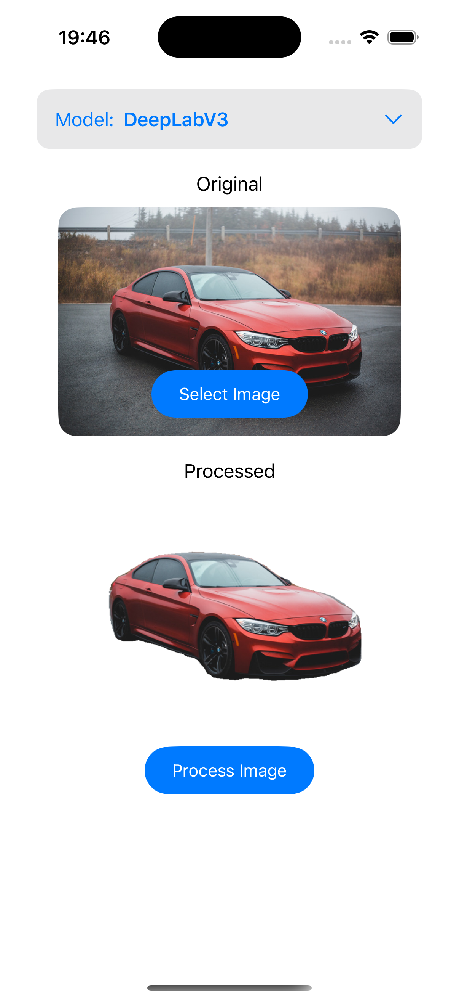
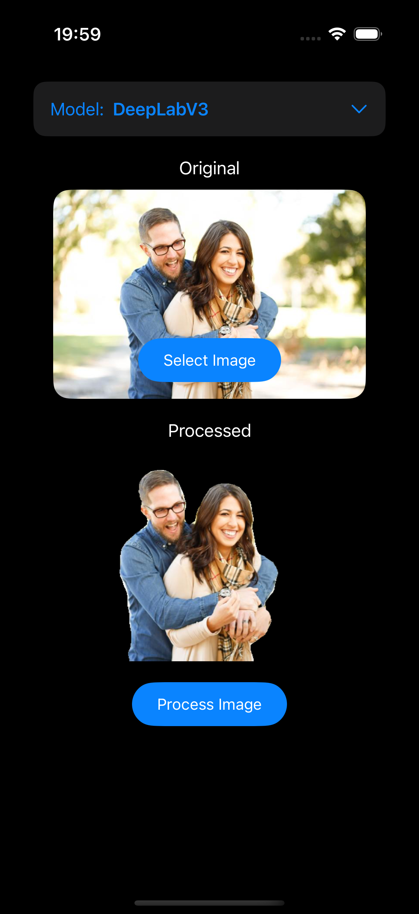

# SegmentationKit

**SegmentationKit** is a Swift package for **on-device background removal** in images. It uses Core ML models to generate **pixel-accurate segmentation masks**, allowing you to efficiently remove backgrounds without relying on any server or internet connection.

## Features

- On-device background removal for privacy and performance
- Pixel-accurate segmentation using Core ML
- Supports multiple models (currently DeepLabV3)
- Async/await support for smooth UI integration

## Installation

SegmentationKit can be installed via **Swift Package Manager**:

```swift
https://github.com/harikrishnabista7/SegmentationKit
```

1. In Xcode, go to **File > Swift Packages > Add Package Dependency…**
2. Enter the repository URL above
3. Choose the version and add the package to your project

## Usage

```swift
import SwiftUI
import SegmentationKit

do {
    // Create a background remover using the DeepLabV3 model
    let segmentation = try SegmentationKit.makeBackgroundRemover(model: .deepLabV3)

    Task {
        // Perform segmentation asynchronously
        let result = try await segmentation.segment(image: inputImage)
        processedImage = result
    }
} catch {
    print("Segmentation failed:", error)
}
```

### Parameters

- `model`: The Core ML model to use for segmentation. Currently supported:

  - `.deepLabV3`

- `image`: The input `UIImage` to perform background removal on.

### Result

- Returns a `UIImage` with the background removed according to the selected model.

## Example

```swift
struct ContentView: View {
    @State private var inputImage: UIImage?
    @State private var processedImage: UIImage?

    var body: some View {
        VStack {
            if let processedImage {
                Image(uiImage: processedImage)
                    .resizable()
                    .scaledToFit()
            }

            Button("Remove Background") {
                Task {
                    do {
                        let segmentation = try SegmentationKit.makeBackgroundRemover(model: .deepLabV3)
                        let result = try await segmentation.segment(image: inputImage!)
                        processedImage = result
                    } catch {
                        print(error)
                    }
                }
            }
        }
    }
}
```

## Samples from bundled example

 

